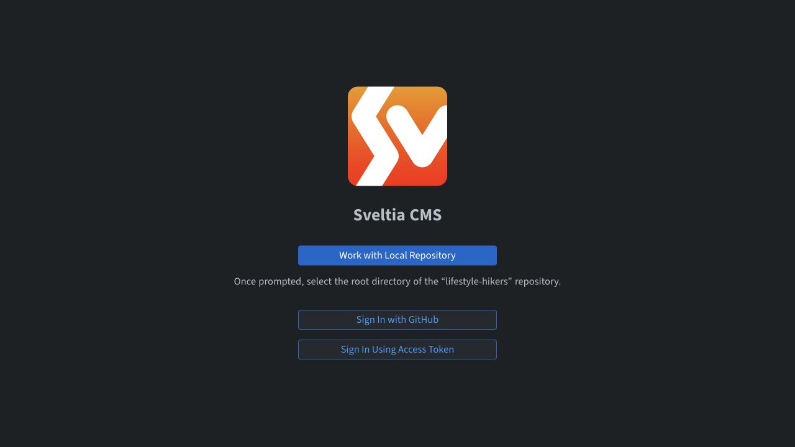
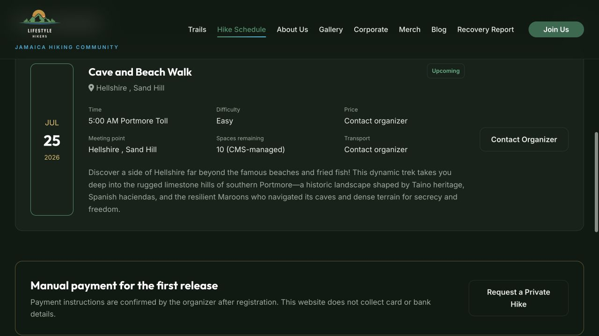
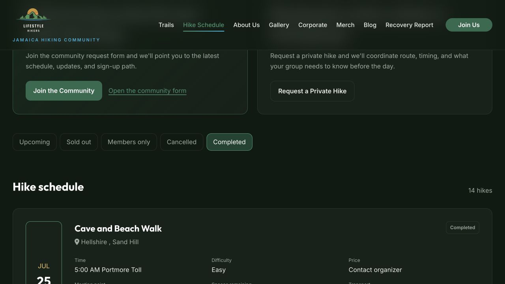

# CMS Hike Workflow Audit

Audit date: 2026-08-05

Surface: Sveltia CMS `Hikes & Events` workflow and the public hike schedule

Primary user goal: quickly record a hike after it happened and have it appear as completed, without scrolling through every older record

## Overall verdict

The workflow had two high-impact defects: new hikes were added from the bottom of one long list, and a stale explicit `upcoming` value could override a past date on the public schedule. Both are fixed. The CMS configuration now puts **Add Hike** above the list, collapses existing records, accepts a minimal past-hike entry, and recommends automatic date-based status. Public templates also enforce the date rule so stale legacy values cannot reopen an old hike.

## Numbered flow

### 1. Enter the CMS — Partial health

The entry screen has clear, visible choices for a local repository, GitHub sign-in, and access-token sign-in. The authenticated editor could not be captured in this audit run because the in-app audit browser could not complete Sveltia's local directory picker and no GitHub credential was supplied. No production sign-in or publish was attempted.

### 2. Find the hike editor — Improved

The collection was labelled **Upcoming Hikes**, even though it stores the complete history. It is now **Hikes & Events → Hike Schedule**, so past-hike entry is discoverable and the navigation matches the job being done.

### 3. Add a hike — Improved

The list had no `add_to_top` or collapsed-entry configuration. With many expanded records, the Add Hike action appeared after the list. It now uses:

- `add_to_top: true`, which Sveltia documents as moving the Add button to the top and inserting new items at the top;
- `collapsed: true`, so existing records do not create a page-length form;
- a corrected summary using the real `date` field rather than nonexistent `month` and `day` fields.

### 4. Record a past hike — Improved

The date field already supported historical dates, but the UI did not explain that and defaulted status to `upcoming`. The editor now says that past dates are allowed, defaults to **Automatic — use the hike date**, and makes time, distance, spots, and description optional for a quick retrospective entry. Name, date, location, and difficulty remain the minimum useful record.

### 5. Publish and view the hike — Fixed

Before:

The July 25 hike was already in the past, but the directory trusted `event_status: upcoming` and displayed a booking-oriented Contact Organizer action.

After:

The status rule is now shared by the homepage and hike directory:

- missing or `auto`: future = Upcoming, past = Completed;
- the hike remains Upcoming for the full calendar day of the hike;
- past `upcoming`, `sold_out`, or `members_only`: Completed;
- `cancelled`: remains Cancelled;
- future explicit special statuses remain available.

The July 25 source record was normalized to `completed`, and the public directory now opens the first category that contains hikes. With no future hike currently scheduled, it opens Completed and reports 14 hikes.

## Strengths

- Git history provides rollback for CMS changes.
- Event status and announcement distribution status are separate concepts.
- The public filters are native buttons with visible text, `aria-pressed`, and a live result count.
- Public status is communicated with text, not color alone.
- Templates sort by date, so editor list position does not control public chronology.

## UX risks and opportunities

1. **Resolved — high:** stale status could make a past hike appear upcoming.
2. **Resolved — high:** Add Hike was below a long single-file list.
3. **Resolved — medium:** collection naming implied that past hikes did not belong in the CMS.
4. **Resolved — medium:** quick past-hike entry required future-booking details.
5. **Resolved — medium:** the recent-completed section referenced an undefined `recent_completed` value and never rendered; it now derives the three most recent completed hikes.
6. **Open — high:** two blog posts publish to `/blog/best-hiking-trails-in-st-andrew-jamaica/`. The validator fails until one post receives a unique slug/permalink or is intentionally unpublished.
7. **Open — medium:** automation bookkeeping fields make each expanded hike form long. A later pass can hide system-owned IDs/timestamps or move events to one file per hike if the archive grows substantially.
8. **Open — low:** some historical copy still says “upcoming,” and several locations contain punctuation/typing inconsistencies. These do not affect status but reduce editorial polish.

## Accessibility findings

- Confirmed on the public schedule: status filters expose button roles and pressed state; the count is announced through `aria-live`; status text is not color-dependent.
- Confirmed on the CMS entry screen: all three sign-in choices have visible button labels.
- Not verified: authenticated CMS keyboard order, focus visibility, validation announcements, mobile reflow, screen-reader field grouping, and the publish confirmation flow. Those checks require an authenticated editor session.
- Browser-driven Enter-key activation was inconclusive in this audit environment, so no claim of complete keyboard conformance is made.

## Verification

- CMS YAML parsed successfully.
- Configuration assertions passed for top-positioned Add Hike, collapsed records, and automatic status default.
- Production Jekyll build completed.
- Generated HTML contains 14 completed hike cards and no upcoming hike cards as of the audit date.
- Browser verification confirmed the Completed filter, `14 hikes`, the July 25 Completed badge, and the repaired recent-completed section.
- Content validation reaches one pre-existing failure only: the duplicate blog route named above.

## Evidence limits

The authenticated editor and an actual GitHub publish were not exercised, avoiding an external content change and because the audit browser could not complete Sveltia's local directory permission flow. Configuration behavior is grounded in the official Sveltia list-field documentation and verified against the generated site, but the next authenticated CMS session should confirm the exact editor presentation once before production use.
